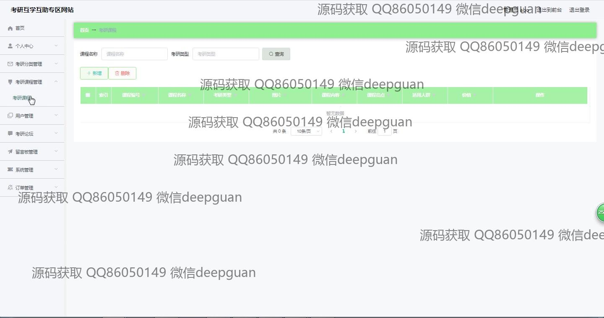

<h1 align="center">的考研互助辅导平台vue</h1>

## 简介
考研互助辅导平台：角色分为管理员、用户；支持课程管理、用户信息管理、订单管理、留言反馈、考研经验分享、论坛互动、图片上传与编辑等功能模块。    --计算机毕业设计源码；毕设源码；java毕业设计源码

## 联系方式

<h3 align="center">获取完整代码与数据库文件 + 微信：deepguan QQ: 86050149 QQ群: 783742310</h3>

<h3 align="center">可帮忙远程部署 包运行成功！提供远程部署、修改代码、设计文档指导、代码讲解等服务！</h3>

## 功能介绍（完整见运行截图）
管理员：基本功能包括登录、注册和退出。能够管理平台的多个模块，如考研经验、考勤记录、用户、留言板、系统、订单及课程，支持课程的新增、编辑、删除和查询，提供课程管理的富文本编辑器以便添加详细内容和图片，能查看和管理不同状态的订单，管理用户的权限和信息，上传和管理网站图片资源，并在后台调整网站的各项功能和设置。  

用户：用户可以通过登录和注册来访问平台，查看和编辑个人信息，通过个人中心进行操作，如修改密码、查看余额、更新账户资料等。用户可以浏览和搜索考研课程、购买课程以及参与论坛讨论和留言反馈。用户界面支持查看商品的详细信息及购课操作，包括将课程加入购物车、立即购买等，并可以在订单管理模块中查看订单状态和详细信息，参与论坛和课程的评论与互动。

## 运行截图

本代码来源于网络,仅供学习参考使用!

